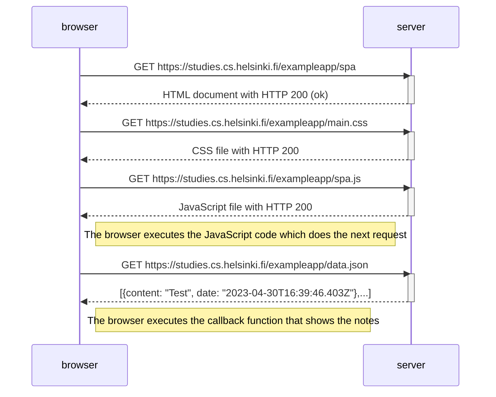

```mermaid
sequenceDiagram
    participant browser
    participant server

    browser->>server: GET https://studies.cs.helsinki.fi/exampleapp/spa
    activate server
    server-->>browser: HTML document with HTTP 200 (ok)
    deactivate server

    browser->>server: GET https://studies.cs.helsinki.fi/exampleapp/main.css
    activate server
    server-->>browser: CSS file with HTTP 200
    deactivate server

    browser->>server: GET https://studies.cs.helsinki.fi/exampleapp/spa.js
    activate server
    server-->>browser: JavaScript file with HTTP 200
    deactivate server

    Note right of browser: The browser executes the JavaScript code which does the next request

    browser->>server: GET https://studies.cs.helsinki.fi/exampleapp/data.json
    activate server
    server-->>browser: [{content: "Test", date: "2023-04-30T16:39:46.403Z"},...]
    deactivate server

    Note right of browser: The browser executes the callback function that shows the notes
```
