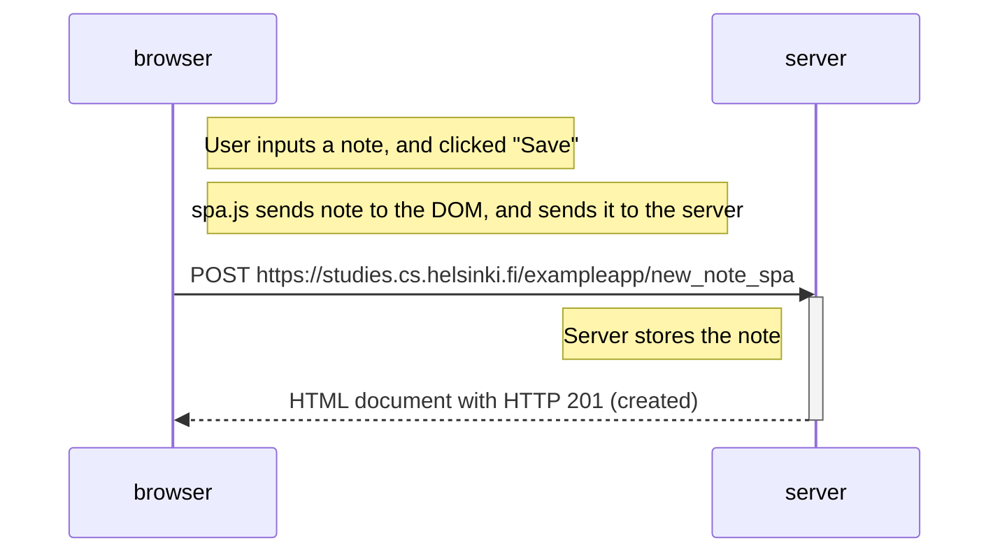

```mermaid
sequenceDiagram
    participant browser
    participant server

    Note right of browser: User inputs a note, and clicked "Save"
    Note right of browser: spa.js sends note to the DOM, and sends it to the server
    browser->>server: POST https://studies.cs.helsinki.fi/exampleapp/new_note_spa
    activate server
    Note left of server: Server stores the note
    server-->>browser: HTML document with HTTP 201 (created) 
    deactivate server

```
